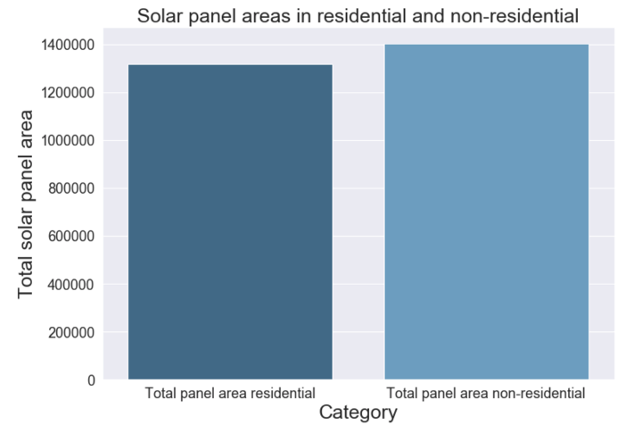
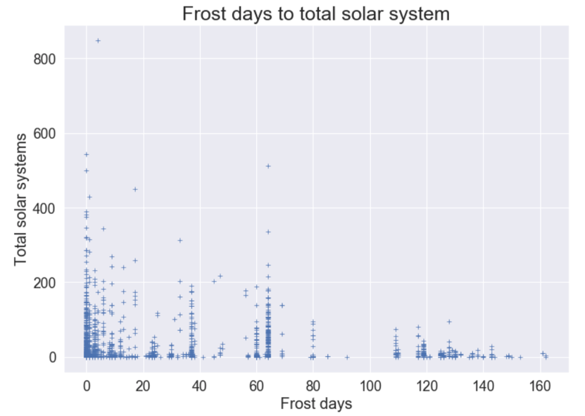
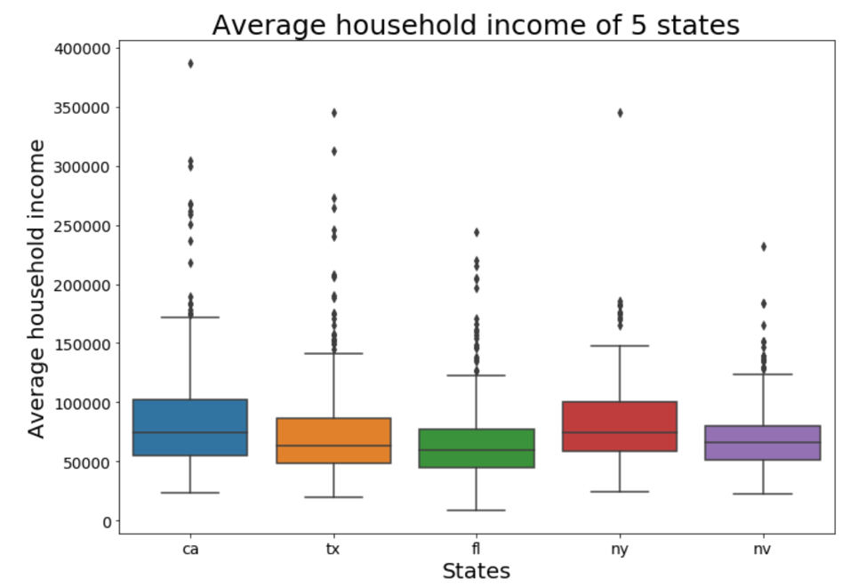
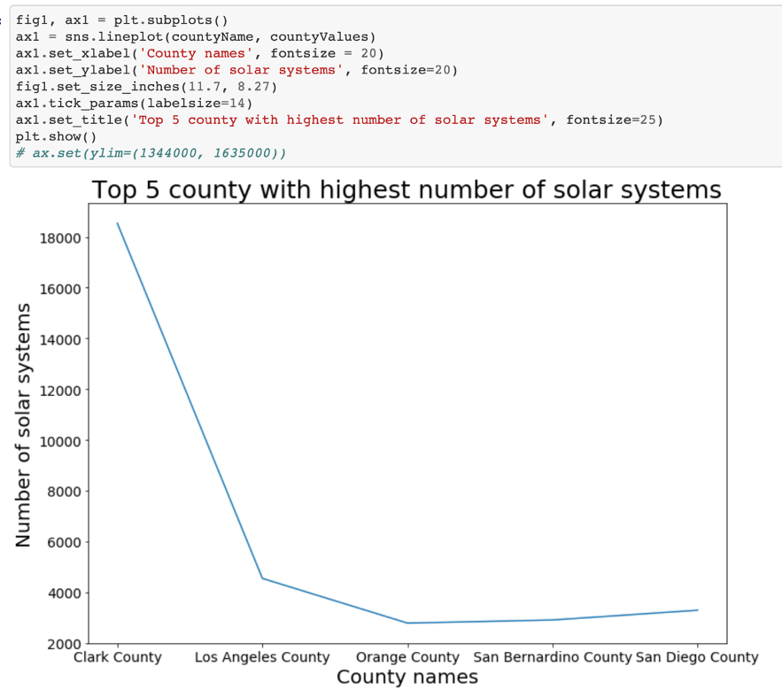
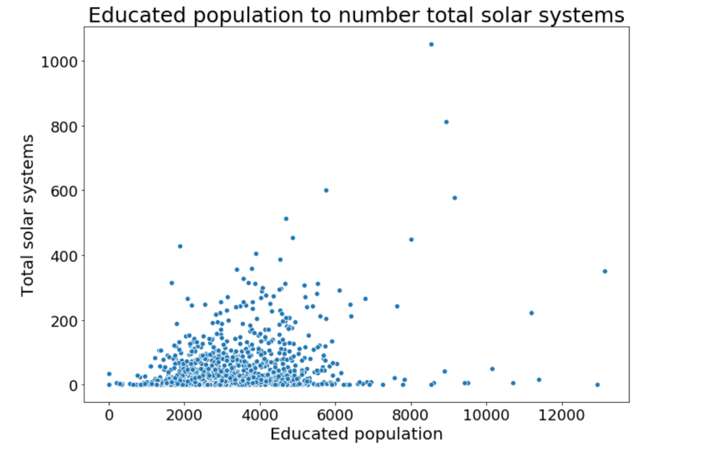

# Deep Solar
Using the Deep learning Data to understand adaptability of Solar Panel installations across US.

## Project brief
The dataset we have chosen is a raw product of deep learning project conducted by Stanford University engineers that used Satellite Imagery to identify location and size of the Photo Voltaic panels across the US. It contains of approximately **73K rows and 169 Columns** consisting of information about, average household income, Number of tiles/solar system(solar panels) installed , size of installation etc. in residential as well as non-residential areas for all the counties/states. For clear visualization we have used data from California, Texas, New York, Florida and Nevada.

## Data Cleaning
* Used data science libraries like numpy and pandas. 
* Filling missing values using mean value used fillna() and many other functions.
* To purely get random values we used random library to generate random number and used for loop to get random rows.

## Data analysis & Visualization
* Used matplotib and seaborn packages for effective packages
* Here are the some of the visuals we have created:

### Some insight from data
We have good insight about data is that as the number of frost days increses there is clearly less number of solar systems in those areas. There is more solar system in non-residential areas then in then residential areas. And in the last visual we have top 5 county with highest number of solar systems.

### Built with
* Python
* Pandas
* Numpy
* Random
* Matplotlib
* Seaborn
* And data structures as list and dictionnary and many others.

## Authors
* Priyanka Soni
* [Bita Faraji](https://www.linkedin.com/in/bita-f-a9889811b/)
* [Yash Choksi](https://www.linkedin.com/in/choksiyash/)

## Acknowledgements
* [Data set URL](https://www.kaggle.com/tunguz/deep-solar-dataset)
* [Project details](http://web.stanford.edu/group/deepsolar/home)
